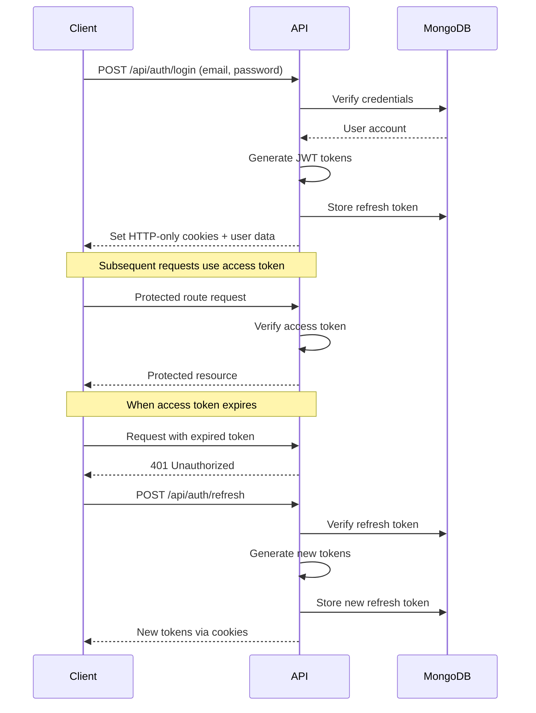

# Cosmos Admin - MongoDB Authentication System

This project has been migrated from Supabase to MongoDB with a custom JWT-based authentication system that provides secure access/refresh token functionality.

## 🔐 Authentication Features

- **JWT-based Authentication**: Access tokens (15min) and refresh tokens (7 days)
- **Password Security**: bcrypt hashing with 12 salt rounds
- **HTTP-Only Cookies**: Secure token storage preventing XSS attacks
- **Token Rotation**: Refresh tokens are rotated on each use
- **Role-Based Access Control**: Admin-only access to the system
- **Automatic Token Refresh**: Seamless token renewal on expiry

## 🚀 Quick Setup

1. **Install Dependencies**
   ```bash
   npm install
   ```

2. **Setup Environment Variables**
   ```bash
   cp .env.example .env.local
   ```
   
   Update `.env.local` with your configuration:
   ```env
   MONGODB_URI=mongodb://localhost:27017/cosmos-admin
   MONGODB_DB=cosmos-admin
   JWT_SECRET=your-super-secure-jwt-secret-key-here
   JWT_REFRESH_SECRET=your-super-secure-refresh-secret-key-here
   ```

3. **Create Initial Admin Account**
   ```bash
   npm run create-admin
   ```
   
   Or with custom credentials:
   ```bash
   ADMIN_EMAIL=your@email.com ADMIN_PASSWORD=yourpassword npm run create-admin
   ```

4. **Start Development Server**
   ```bash
   npm run dev
   ```

5. **Login**
   - Visit `http://localhost:3000`
   - Use the admin credentials created in step 3

## 🏗 Architecture

### Authentication Flow



### Database Schema

**accounts collection:**
```typescript
{
  _id: ObjectId,
  id: string,           // UUID
  email: string,        // Unique user email
  password: string,     // bcrypt hashed password
  role: 'admin' | 'user',
  created_at: Date,
  updated_at: Date
}
```

**refresh_tokens collection:**
```typescript
{
  _id: ObjectId,
  userId: string,       // UUID reference to accounts.id
  token: string,        // JWT refresh token
  created_at: Date,
  expires_at: Date,
  is_revoked: boolean
}
```

### Security Measures

1. **Password Hashing**: bcrypt with 12 salt rounds
2. **JWT Security**: Separate secrets for access and refresh tokens
3. **Cookie Security**: HTTP-only, Secure, SameSite cookies
4. **Token Expiry**: Short-lived access tokens (15min)
5. **Token Rotation**: Refresh tokens are single-use
6. **Role Validation**: Admin role required for access

## 🛠 Development

### API Endpoints

| Endpoint | Method | Description |
|----------|--------|-------------|
| `/api/auth/login` | POST | User login |
| `/api/auth/logout` | POST | User logout |
| `/api/auth/refresh` | POST | Refresh access token |
| `/api/auth/me` | GET | Get current user |
| `/api/auth/register` | POST | Create new account |

### Protecting API Routes

Use the middleware helper to protect API endpoints:

```typescript
import { withAuth } from '@/lib/api-middleware';

export const GET = withAuth(async (req) => {
  // Access authenticated user
  const user = req.user;
  
  return NextResponse.json({ 
    message: `Hello ${user.email}` 
  });
});
```

### Client-Side Authentication

The auth store provides authentication state management:

```typescript
import { useAuthStore } from '@/store/auth';

function LoginComponent() {
  const { login, user, isLoading } = useAuthStore();
  
  const handleLogin = async (email: string, password: string) => {
    const result = await login(email, password);
    if (!result.success) {
      console.error('Login failed:', result.error);
    }
  };
}
```

## 🔄 Migration from Supabase

If you're migrating from Supabase:

1. **Remove Supabase dependencies** (optional):
   ```bash
   npm uninstall @supabase/supabase-js @supabase/ssr
   ```

2. **Update environment variables** following the setup guide

3. **Migrate user data** if needed:
   - Export users from Supabase
   - Import to MongoDB using the registration API

4. **Test authentication flow** thoroughly

## 🐛 Troubleshooting

### Common Issues

1. **"JWT secrets must be provided"**
   - Ensure `JWT_SECRET` and `JWT_REFRESH_SECRET` are set in `.env.local`

2. **MongoDB connection failed**
   - Verify `MONGODB_URI` is correct
   - Ensure MongoDB service is running

3. **Token verification failed**
   - Check if access token cookie exists
   - Try logging out and back in

4. **Admin access denied**
   - Verify user role is "admin" in database
   - Check account creation was successful

### Debug Mode

Add these environment variables for detailed logging:
```env
DEBUG=auth:*
NODE_ENV=development
```

## 📚 Additional Resources

- [JWT.io](https://jwt.io/) - JWT debugging
- [MongoDB Documentation](https://docs.mongodb.com/)
- [bcrypt Documentation](https://github.com/kelektiv/node.bcrypt.js/)

## 🤝 Contributing

When contributing authentication-related changes:

1. Ensure passwords are never logged
2. Test token expiry scenarios  
3. Validate all security headers
4. Update this documentation if needed

---

**⚠️ Security Notice**: Change default passwords immediately in production environments!